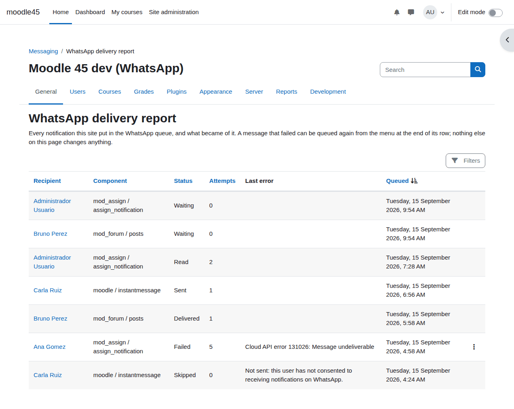
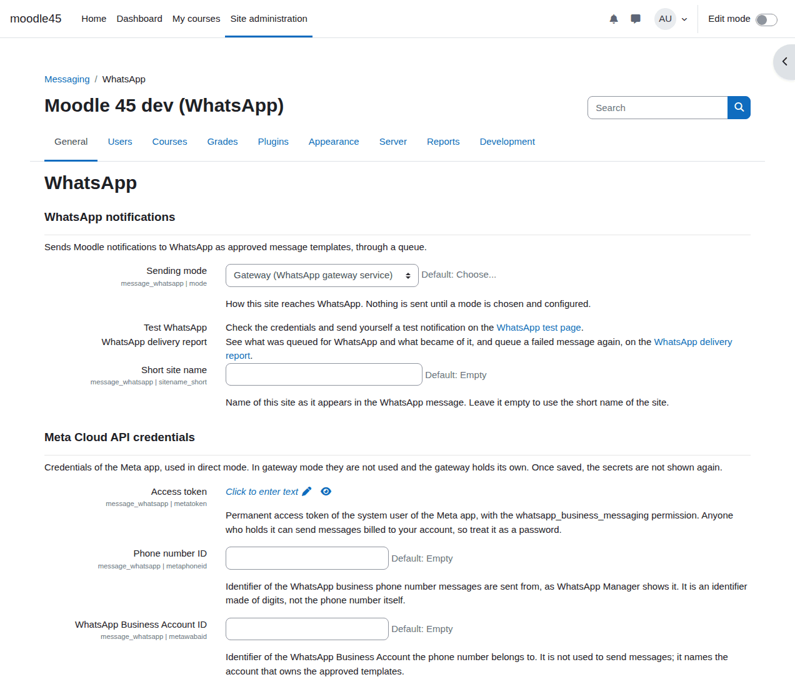
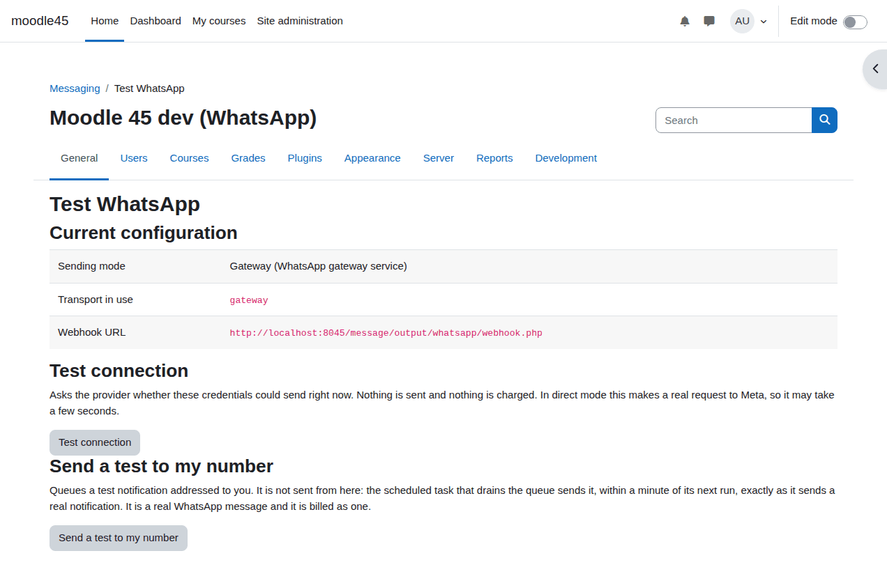
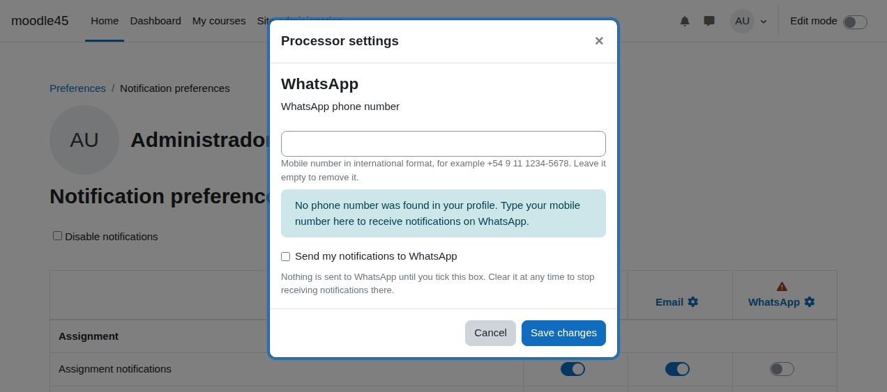
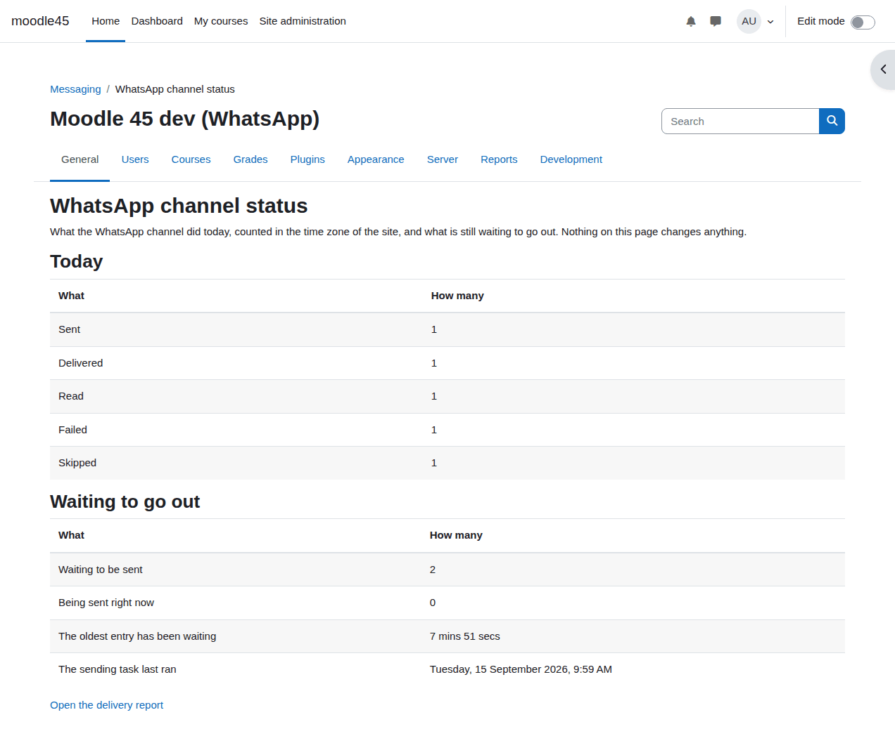

# WhatsApp notifications for Moodle (`message_whatsapp`)

A Moodle *message output* plugin that delivers Moodle notifications to WhatsApp.

When a student is graded, a forum they follow gets a reply or an assignment is about to close, Moodle raises a
notification. This plugin takes those notifications and sends them to the phone number of the recipient as a
WhatsApp message, through the official **WhatsApp Cloud API** of Meta.

- **Status: alpha.** It sends end to end, it has been tested against the real Graph API, and it has not yet been
  run for a term with real students. Read [CHANGELOG.md](CHANGELOG.md) before installing it anywhere that matters.
- **Licence:** GPL v3 or later. Free, and it stays free: the plugin adds nothing to what Meta charges you.



*The delivery report: every notification the site queued, and what became of it.*

---

## Read this first: the test number sends to five people

Meta gives you a free test phone number as soon as you create the app. It is enough to prove that everything
works, and it is **not** enough to run a pilot:

> **The Meta test number can only send to five recipients, and you have to add each of those five phone numbers
> by hand in the Meta dashboard.** A sixth person will receive nothing at all. The plugin will show the message
> as sent, Meta will accept the request, and the message will simply not arrive.

If you follow this guide with the test number and a colleague does not get their notification, count the
recipients in the Meta dashboard before you look for a bug. To send to a whole cohort you need **your own phone
number on the platform plus Meta's business verification**, which is a separate process that takes weeks. Start
it early. (Limit verified against Meta's documentation on 13 September 2026.)

---

## What it does

```
Moodle raises a notification
   -> the plugin checks the recipient has a phone number and has opted in
   -> it shortens the message into the three fields of an approved template
   -> it writes a row into a queue in the database, and returns. No network call.

a scheduled task runs every minute
   -> it takes a batch of pending rows
   -> it sends each one to the WhatsApp Cloud API as an approved UTILITY template
   -> failures that can succeed later are retried with a growing delay, five times
   -> failures that cannot are written off once, with the reason

Meta calls back
   -> webhook.php records sent / delivered / read / failed for each message
   -> when the recipient taps the button, go.php records the click and sends them to Moodle
```

Two things follow from how WhatsApp works, and they explain most of the setup below:

1. **Everything is sent as an approved template.** Meta only allows free text in the 24 hours after the *user*
   writes to your business number, which a Moodle notification practically never falls into. So the plugin sends
   one template, `moodle_notification`, that you create and Meta approves once. Nothing is ever sent as free text.
2. **The button of a template has a fixed address.** A template button cannot point anywhere it likes per
   message: the part of the address that Meta approved is frozen, and only a short suffix changes. This is why
   you have to create the template **with your own Moodle address in it**. See
   [Create the template](#5-create-the-template).

## What it does not do

Being explicit, because these are the things people assume:

- **It does not receive.** A reply the student types in WhatsApp goes nowhere. It does not reach the forum, the
  teacher or Moodle at all.
- **It does not send personal messages between users.** Only notifications (`notification == 1`). A private
  message from a teacher to a student stays inside Moodle.
- **It does not verify the phone number.** There is no one time code. A number typed with a digit wrong is a
  number that quietly fails, or worse, a stranger who gets somebody else's notifications.
- **It is not an attendance or marketing channel.** The template is registered as UTILITY, which is the category
  for messages about something the person already has with you.
- **It does not reach the Moodle mobile app**, and it is not an alternative to email: it is an additional output
  that each user turns on for themselves.
- **It does not verify who is on the other end of a number.** See above: the phone number is whatever the
  profile says.

---

## Requirements

| | |
|---|---|
| Moodle | 4.5 LTS (build 2024100700) or 5.2 LTS |
| PHP | 8.1 to 8.3 on Moodle 4.5, 8.3 to 8.4 on Moodle 5.2 |
| Cron | Moodle cron must run every minute. Nothing is ever sent by a web request. |
| HTTPS | Required, with a certificate a browser accepts. Meta will not deliver webhooks to plain HTTP or to a self signed certificate. |
| Composer | None. All HTTP goes through Moodle's own `\core\http_client`. |
| From Meta | A Facebook account with two factor authentication, a business portfolio, an app, a WhatsApp Business Account and a phone number. See [Set up Meta](#set-up-the-meta-side). |

The Moodle site has to be reachable from the internet for two reasons: Meta posts delivery reports to
`webhook.php`, and the button in the message opens `go.php`. A Moodle on `localhost` can send, but nothing will
come back and no button will work.

### The two sending modes

The *Sending mode* setting picks which of the two the site uses, and it is the only difference between them:
everything else -- the opt-in, the phone numbers, the queue, the retries, the report -- is the same code.

| | **Direct** | **Gateway** |
|---|---|---|
| What you need | A Meta app, a WhatsApp Business Account, a phone number and an approved template | A WhatsApp Business Account, created through the service's guided sign-up, plus the service address and one API key |
| Who owns the WhatsApp account | You | You. The service operates it with permission you grant, and you can withdraw that permission at any time |
| Who does the Meta work | You: the app, the tokens, the template and the webhook | The service, inside your account |
| Delivery reports arrive | Pushed by Meta to `webhook.php` | Pulled from the service every five minutes |
| What Meta bills you | Your own messages, on the payment method in your account | The same: your own messages, on the payment method in your account |
| What the service bills you | Nothing. There is no service | The software, separately from what Meta charges |
| The button in the message opens | `go.php` of this site | A short link of the service, which lands on `go.php` of this site |

The requirements table above is direct mode. **Gateway mode still needs no public webhook**, because nothing is
pushed at the site: the two settings under *Gateway service* are the whole of the Moodle side, and the *Test
connection* button tells you whether the key works.

What gateway mode does need is a WhatsApp Business Account of your own, and the difference is who does the work
inside it. The service walks you through creating it in a few minutes, then registers your number and gets the
template approved for you. **You are the account holder throughout**: the number is yours, the messages go out
under your name, and Meta bills you for them. What you save is the setup and the operating, not the account.

Two things stay yours in both modes, because Meta asks them of the account holder and no software can do them
for you: **adding a payment method**, without which nothing is delivered, and **verifying your business**, until
which Meta caps the account at 250 conversations started per 24 hours.

## Install

Put the plugin in the `message/output/whatsapp` directory of your Moodle, the same as any other message output
plugin.

```bash
# Moodle 4.5
git clone https://github.com/gpcuneo/moodle-message_whatsapp.git \
    /path/to/moodle/message/output/whatsapp

# Moodle 5.2 — the servable tree moved under public/ in Moodle 5.0
git clone https://github.com/gpcuneo/moodle-message_whatsapp.git \
    /path/to/moodle/public/message/output/whatsapp
```

Then finish the installation from *Site administration > Notifications*, or from the command line:

```bash
php admin/cli/upgrade.php
```

The settings live in **Site administration > General > Messaging > WhatsApp**. To uninstall, use
*Site administration > Plugins > Plugins overview*; that removes the plugin's three tables and everything in them.

---

# Set up the Meta side

This is the long part. It is done once, and none of it is Moodle. Budget an hour for a first time, plus
whatever Meta's template review takes (usually minutes, occasionally a day).

What you will end up with, and where each piece goes in Moodle:

| What Meta gives you | Moodle setting |
|---|---|
| Phone number ID | *Phone number ID* |
| WhatsApp Business Account ID | *WhatsApp Business Account ID* |
| Permanent access token | *Access token* |
| App secret | *App secret* |
| A string you invent yourself | *Webhook verify token*, and the same string in Meta |

## Gateway mode, in two settings

If you are using a gateway service, **steps 1 to 8 below are not yours to do**: the service does them inside
your own WhatsApp Business Account. What stays yours is the payment method and your business verification, and
the service tells you when. Skip to this section, and then to step 9.

1. *Site administration → Plugins → Message outputs → WhatsApp*.
2. **Sending mode**: Gateway.
3. **Service address**: the base address the service gave you, for example `https://wa.example.com`. Nothing
   after the host; the plugin adds the paths.
4. **API key**: the key the service issued for this site. It is shown once when the subscription is created and
   cannot be read back, so if it is lost you ask for a new one.
5. Save, then open *Test connection*. It asks the service who the key belongs to and sends nothing. Three
   answers are worth knowing:

   | Answer | What it means |
   |---|---|
   | `invalid_api_key` | The key is wrong, or it was revoked. Check what you pasted. |
   | `tenant_suspended` | The key is right and the subscription is not active. It is a billing matter, not a configuration one. |
   | `blocked_by_site` | Moodle refused to make the call. See below. |

**If the service is on a private address**, for instance on the same network as the Moodle, Moodle blocks the
request before it leaves: *Site administration → General → Security → HTTP security* blocks the loopback address
and the private ranges by default, which is what stops a plugin from being used to reach the inside of your
network. Allow the host there. A service on a public address needs none of this.

The rest of the plugin behaves exactly as it does in direct mode, with two differences you will notice: the
*Meta Cloud API credentials* section is not used and can stay empty, and delivery statuses appear a few minutes
later than in direct mode, because the site fetches them every five minutes instead of Meta pushing them.

## 1. Business portfolio, app and WhatsApp Business Account

1. Sign in to [business.facebook.com](https://business.facebook.com) with a **personal Facebook account that has
   two factor authentication on**. There is no way around this: Meta's Business Manager is administered from a
   personal profile. Create a business portfolio if the institution does not have one.
   Use an address on the institution's own domain, not a free webmail account.
2. In [developers.facebook.com](https://developers.facebook.com), create an app with the use case
   **"Connect with customers through WhatsApp"**, and attach it to that portfolio.
3. In the app, add the **WhatsApp** product. It will create or let you connect a **WhatsApp Business Account**
   (WABA), and it will give you a free **test phone number**.

> Do not register a phone number that is already in use in the normal WhatsApp app. Registering it in the Cloud
> API takes it out of the app, for good.

## 2. Write down the two identifiers

In the app, go to **WhatsApp > API Setup**. Copy:

- the **Phone number ID** — a long number under the test number. This is *not* the phone number itself.
- the **WhatsApp Business Account ID** — the WABA id, on the same screen.

## 3. Add your test recipients

On the same **API Setup** screen there is a "To" field with a **Manage phone number list** button. Add the
numbers that are going to receive the test messages, in full international format. Each one gets a confirmation
code on WhatsApp.

**You can add five.** See the warning at the top of this file. Anything sent to a sixth number is accepted by
Meta and never delivered.

## 4. Create a permanent access token

The token shown on the API Setup screen expires in a day and is useless for a site that sends every minute. The
permanent one comes from a system user:

1. **Business settings > Users > System users > Add**. Create a system user with the **Admin** role.
2. **Add assets**: give it your **app** and your **WhatsApp Business Account**, both with **full control**.
3. **Generate token**, choose the app, set the expiry to **Never**, and tick exactly these three permissions:
   - `whatsapp_business_messaging`
   - `whatsapp_business_management`
   - `business_management`
4. Copy the token **now**. Meta shows it once.

A token missing `whatsapp_business_messaging` fails on every send with Meta error 200 or 3. A token missing
`whatsapp_business_management` can send but cannot manage templates.

## 5. Create the template

This is the step that goes wrong most often, and always in the same place: the address in the button.

The plugin sends one template, and it is not configurable:

| | |
|---|---|
| Name | `moodle_notification` — exactly, lower case, with the underscore |
| Category | **UTILITY** |
| Languages | `es_AR` **and** `en` — both, even if your site is monolingual |
| Body | Three variables, `{{1}}` `{{2}}` `{{3}}`, in that order, with fixed text before the first and after the last |
| Buttons | Exactly one, of type **URL**, with a variable at the end of the address |

The three body variables are, in order:

| | What the plugin puts in it | Longest it can be |
|---|---|---|
| `{{1}}` | Short name of your site | 60 characters |
| `{{2}}` | Subject of the notification | 60 characters |
| `{{3}}` | One line summary of the message | 160 characters |

The exact definition, ready to send to Meta, is in **[`docs/template.json`](docs/template.json)**. Everything in
that file outside the `versions` object is documentation; each entry inside it is a complete request body, one
per language.

### The button address — read this twice

The button in the message has to bring the person back to *your* Moodle. Meta freezes the address at approval
time and lets only a suffix change per message, so the address you type when you create the template is:

```
https://YOUR-MOODLE-ADDRESS/message/output/whatsapp/go.php?t={{1}}
```

Replace `https://YOUR-MOODLE-ADDRESS` with the exact value of `$CFG->wwwroot` of your site — the address you type
in a browser to reach Moodle, with no trailing slash. If your Moodle lives in a subdirectory, include it:
`https://example.edu/moodle/message/output/whatsapp/go.php?t={{1}}`.

The `{{1}}` at the end must be the last thing in the address. Meta requires it, and the plugin puts a short
signed code there that names the notification. It carries no personal data, and it cannot be edited to point at
somebody else's message.

If you copy `moodle.example.edu` out of `docs/template.json` without changing it, Meta will approve the template
and every button in every message will take your students to a site that is not yours. Nothing in the plugin can
detect this: check it before you submit.

### Creating it, either way

**Through the dashboard** (easier the first time). In **WhatsApp Manager > Message templates > Create template**:
name `moodle_notification`, category **Utility**, language **Spanish (ARG)**. Paste the body text of
`versions.es_AR` from [`docs/template.json`](docs/template.json), exactly as it is there; fill the sample values
Meta asks for. Do not trim it down to `{{1}}: {{2}}` and `{{3}}`: Meta rejects a body that starts or ends with a
variable. Add a button of type
**Visit website**, **Dynamic**, label `Ver en Moodle`, address as above. Submit. Then **Add language** and repeat
the whole thing for **English**, with label `View in Moodle`.

If the form asks whether the variables are positional or named, choose **positional** (`{{1}}`, not `{{name}}`).
The sample it asks for on the button is the *suffix* alone, not the whole address.

**Through the API**, one call per language, using the WABA id and the token from the steps above:

```bash
curl -X POST "https://graph.facebook.com/v25.0/<WABA-ID>/message_templates" \
  -H "Authorization: Bearer <TOKEN>" \
  -H "Content-Type: application/json" \
  -d @es_AR.json     # the versions.es_AR object of docs/template.json, with your address in the button
```

Wait for both languages to show **Approved** before you turn the channel on in Moodle. A template that does not
exist, or exists in only one language, fails once per notification with Meta error 132001.

### What you may change, and what you may not

Safe to change: the wording around the variables, the label of the button and the sample values. The plugin
never reads any of it.

**But there must be fixed text before `{{1}}` and after `{{3}}`.** Meta rejects a template whose body starts or
ends with a variable — *"The message template cannot start or end with a parameter (dangling parameters are not
allowed)"*, [Template review](https://developers.facebook.com/documentation/business-messaging/whatsapp/templates/template-review).
The body in `docs/template.json` already satisfies this. Reword it if you like; do not delete it.

Not safe to change, because the plugin's requests would stop matching the template: the name, the two language
codes, the number of body variables (three) or their order, and the presence of the URL button. The plugin sends
a button component with every single message, so a template without a button is rejected with Meta error 132000.

## 6. App secret and verify token

- **App secret**: in the app, **Settings > Basic > App secret > Show**. This is what proves that a delivery
  report really came from Meta.
- **Verify token**: a random string that *you* invent, right now. Anything long and unguessable — the output of
  `openssl rand -hex 32`, for instance. It is a shared password between your Moodle and Meta, nothing more. You
  will paste the same string in two places.

---

# Configure Moodle

Everything is in **Site administration > General > Messaging > WhatsApp**.



## 7. The settings

These are all of them. The name in brackets is the internal name, which is what you would use in
`admin/cli/cfg.php` or in a configuration script; it is also the name that appears in error messages.

**General**

| Setting | Internal name | What to put |
|---|---|---|
| Sending mode | `mode` | **Direct (own Meta Cloud API credentials)**. Nothing is sent until this is chosen. |
| Short site name | `sitename_short` | The name of your institution as it should read on a phone, at most 60 characters. Leave empty to use the site's short name. This is `{{1}}`. |

**Meta Cloud API credentials**

| Setting | Internal name | What to put |
|---|---|---|
| Access token | `metatoken` | The permanent token from step 4. Stored masked. |
| Phone number ID | `metaphoneid` | From step 2. Digits only. |
| WhatsApp Business Account ID | `metawabaid` | From step 2. Not used to send; it names the account that owns the templates. |
| App secret | `metaappsecret` | From step 6. Used to check the signature of every delivery report. Stored masked. |
| Webhook verify token | `metaverifytoken` | The string you invented in step 6. The same string goes in Meta. Stored masked. |
| Graph API version | `graphversion` | Leave it alone unless you have read Meta's changelog. Empty means the version this release was written for. |

The same screen prints the **Webhook URL** you need for step 8. It is text, not a setting.

**Recipients**

| Setting | Internal name | What to put |
|---|---|---|
| Phone number field | `phonesource` | Which profile field the number is first read from: *Mobile phone (phone2)* (the default), *Phone (phone1)*, or *None, the user types the number*. Whatever you choose, the user can correct their number in their own preferences. |
| Default country | `defaultcountry` | Country whose dialling rules apply to a number typed without a `+`. Default Argentina. A number that already starts with `+` is never touched. |

**Template**

The template name and its two languages are shown here and cannot be edited. That is deliberate: a text field
there would look like a way to point the site at a different template, and would mostly be a way to point it at
one that does not exist, which fails once per notification instead of once on this screen.

**Sending**

| Setting | Internal name | Default | What it does |
|---|---|---|---|
| Respect quiet hours | `quiethours` | On | Messages raised inside the quiet window wait, they are not discarded. A WhatsApp notification rings a phone on a bedside table. |
| Quiet hours start | `quietstart` | 22:00 | Site time zone. |
| Quiet hours end | `quietend` | 08:00 | Site time zone. |
| Daily limit per user | `dailycap` | 0 | Most messages one person can be sent in a day. Anything over is recorded as *skipped* and never sent. `0` means no limit. This is a cost control, and it costs notifications. |
| Messages per run | `batchsize` | 100 | How many queued messages the task takes each minute. Raise it only if the queue falls behind. |

**Data retention**

| Setting | Internal name | Default | What it does |
|---|---|---|---|
| Keep finished messages for (days) | `retention` | 90 | Days a finished queue row (sent, delivered, read, failed, skipped) is kept before the daily cleanup task deletes it, with its clicks. Rows still waiting to be sent are never deleted. |

## 8. Point Meta's webhook at your site

1. Copy the **Webhook URL** printed on the plugin's settings page. It is
   `https://YOUR-MOODLE-ADDRESS/message/output/whatsapp/webhook.php` and it is the same address on Moodle 4.5 and
   5.2.
2. In the Meta app, **WhatsApp > Configuration > Webhook > Edit**. Paste the URL as the **Callback URL** and your
   verify token from step 6 as the **Verify token**.
3. Press **Verify and save**. Meta calls your site immediately; if the token matches, it saves. If it does not,
   check that you saved the setting in Moodle first, and that the address is reachable over HTTPS from outside.
4. **Subscribe to the `messages` field.** This is a separate checkbox on the same screen and it is easy to miss.
   Delivery reports come back through it. Without it everything still sends, and every message stays at *sent*
   for ever.

Nothing else needs to be subscribed. The plugin ignores every other kind of callback and answers 200 to it, which
is what Meta needs to hear.

## 9. Turn the channel on and test it

1. **Site administration > General > Messaging > Notification settings**: make sure **WhatsApp** is enabled as an
   output, and is not disabled for the notification types you care about.
2. Go to **Site administration > General > Messaging > Test WhatsApp**. Press **Test connection**. It asks Meta
   whether your token and phone number ID work, without sending anything. A green answer means the credentials
   are right. A red one prints the error code — see [When something fails](#when-something-fails).
3. Set your own phone number and tick the opt-in box in your own preferences (step 10), then press
   **Send a test to my number** on the same page. It **queues** a notification; it does not send it there and
   then, on purpose, because that would test a path no real notification takes.


4. Run cron, or wait a minute: `php admin/cli/cron.php`. The message should arrive.
   - If the page said the message was *deferred*, you are inside the quiet hours window. It will go out when the
     window closes, or you can turn `quiethours` off to see it now.
   - If nothing arrives, check that your number is one of the five in Meta's recipient list.

## 10. How a user opts in

Nothing is ever sent to somebody who has not asked for it. There is no way for an administrator to switch this on
for other people in this release.

Each user, in their own **Preferences > Notification preferences**, opens the settings of the **WhatsApp**
column and finds two fields:



- **WhatsApp phone number** — prefilled from their profile according to `phonesource`, and editable. It has to be
  a mobile in international format, `+54 9 11 1234-5678`. The form warns them if the number looks like a
  landline or could not be read.
- **Send my notifications to WhatsApp** — the opt-in checkbox. Until it is ticked, nothing is sent. Clearing it
  stops everything immediately.

Then, in the same screen, they choose which notifications go to WhatsApp, the same way they do for email.

Tell your users what they are agreeing to: their phone number is stored by Moodle, and the text of each
notification is sent to Meta, outside the country. That is a disclosure obligation in most places, and in
Argentina it falls under Ley 25.326.

---

## Where to see what happened

The plugin keeps a row for every notification it handled, and a delivery report page that shows them, at
`/message/output/whatsapp/report.php`. It sits next to the settings under **Messaging** in Site administration,
and the settings page links to it.

The report lists, newest first: the recipient, the Moodle component that raised the notification, the status, how
many attempts it took, the error if there was one, and when it was raised. It can be filtered by status, by
recipient, by component and by date. A failed message can be queued again from there, one at a time, through a
confirmation.

The statuses mean:

| Status | Meaning |
|---|---|
| `pending` | Waiting for the sending task. Also where a message goes back to between retries, and where it waits out the quiet hours. |
| `sending` | Claimed by a run of the task right now. |
| `sent` | Meta accepted it. It has not necessarily arrived. |
| `delivered` | It reached the phone. |
| `read` | The recipient opened it. Only if they have read receipts on. |
| `failed` | It will not be sent. The error column says why. |
| `skipped` | Never attempted: no opt-in, over the daily cap, or a number the provider refused to deliver to. |

Reading the report needs the `message/whatsapp:viewlog` capability, which a manager can be given without also
being given the capability that hands out the site's Meta credentials.

Next to it is a **status page**, at `/message/output/whatsapp/status.php`, which answers the other question:
not what became of one message, but whether anything is going out at all. It shows what the channel did today
— sent, delivered, read, failed, skipped — what is still waiting, how long the oldest entry has been waiting,
and when the sending task last ran. If there is something waiting and that task has not run in ten minutes, the
page says so in red: it is scheduled every minute, so a silence that long means cron is not running or is not
reaching it, and a queue that is not being drained looks exactly like a queue with nothing in it.



Rows disappear after `retention` days, and so do the records of the clicks on their buttons. Entries still
waiting to be sent are never deleted. Set `retention` to 0 to keep everything for good. The report can only show
what has not been cleaned up yet.

### A number WhatsApp cannot reach

When Meta answers that a number is undeliverable — it is not on WhatsApp, or it is a landline that ended up in
the profile field — the plugin marks that number as invalid and stops sending to it. The person sees a notice in
their own notification preferences saying that WhatsApp could not deliver to it and how to fix it, and their
later notifications are recorded as `skipped` with that reason rather than attempted again. **Saving a number in
their preferences clears the mark**, which is the only thing that does; nothing an administrator can do from the
report brings it back, because the number is the user's to correct.

## When something fails

The plugin never invents an explanation. When Meta refuses something, the code Meta returned is shown as
`meta_<number>`, and that number is the one to search for in Meta's error reference or to quote in a support
ticket.

The ones you are most likely to meet while following this guide:

| Code | What it actually means |
|---|---|
| `meta_190`, `meta_0` | The access token is expired or unreadable. You probably saved the temporary one from the API Setup screen. Go back to step 4. |
| `meta_200`, `meta_3`, `meta_10` | The token does not carry the permissions it needs. Reissue it with all three. |
| `meta_33` | The *Phone number ID* is wrong, or belongs to a number that was deleted. |
| `meta_132001` | The template does not exist in that language, or is not approved yet. Both `es_AR` and `en` have to be approved. |
| `meta_132000` | The number of parameters does not match the template. Usually a template built with two body variables instead of three, or with no button. |
| `meta_131026` | Undeliverable: not a WhatsApp number, or a phone that has been off for a month. It is written off immediately, without retrying, but the number stays on the user's record: the next notification for that person will fail the same way. Fix or clear the number in their preferences. |
| `meta_131047` | Meta did not treat the message as a template. If you see this, the template is not approved as UTILITY. |
| `meta_131042` | Something is wrong with the payment method on the Meta account. |
| `network_error` | The request never reached Meta: DNS, a firewall, a proxy. Nothing to do with your credentials. |

Failures that can succeed later — Meta being overloaded, a rate limit — are retried five times with a growing
delay, up to about an hour. Failures that cannot are written off immediately, so that the real cause is visible
instead of buried under four identical attempts.

**The message says sent but nobody got it.** Almost always one of three things: the recipient is not one of the
five on the test number's list; the `messages` webhook field is not subscribed, so the status never moved past
*sent*; or the number is right but is not on WhatsApp.

**Nothing is ever queued.** Check, in order: a sending mode is chosen; WhatsApp is enabled in *Notification
settings*; the user has a phone number **and** has ticked the opt-in box; and cron is actually running every
minute.

---

## Costs

**The plugin is free.** What Meta charges is separate, and it goes directly from Meta to whoever owns the account.

**How Meta bills, as of this writing.** Since **1 July 2025** Meta charges **per delivered message**, not per
24 hour conversation as it used to. Every message this plugin sends is a **UTILITY** template, and utility
templates are priced by the recipient's country.

**When it is free.** A utility template delivered inside an open 24 hour customer service window — that is, when
the recipient has written to your business number in the previous 24 hours — is **not charged**. A Moodle
notification almost never falls inside such a window, so plan on being charged for most of them.

**What it will cost you.** This document does not quote a price, on purpose: Meta's rates change and are
per country, and a number written here would be wrong within a year and believed anyway. Check the current rate
for your country in **Meta's WhatsApp pricing documentation**
([developers.facebook.com/docs/whatsapp/pricing](https://developers.facebook.com/docs/whatsapp/pricing)), and
check what you are actually spending in **WhatsApp Manager > Insights**, and in the billing section of your
business portfolio. Do that before you enable the channel for a whole institution: the arithmetic is one message
per notification per opted-in user, and a busy course can raise a lot of notifications.

**What you can do about it from Moodle**, all on the settings screen:

- *Notification settings* decides which notification types may use WhatsApp at all. This is the biggest lever:
  turn on the handful that are worth a phone buzzing, not everything.
- `dailycap` caps how many messages one user can be sent per day. Anything over the cap is dropped, not delayed.
- Opt-in is per user, so you only pay for the people who asked.

**What is not verified here.** Whether messages to the five test recipients of the free test number are billed,
and the free tier Meta may apply to a new account, were not confirmed while writing this. Look at your own
billing screen in the first week.

---

## Privacy and data

The plugin stores, per user, the phone number, where it came from, whether they opted in and when, and the state
of each message it sent them: the template used, the three parameters, the destination, the status, the Meta
message id, and the error if there was one. It also records a row when a button is tapped.

It ships a complete Privacy API provider: a subject access request exports all of it, and a deletion request
removes it. Meta and the gateway service are declared as external locations, because
that is what they are — the text of the notification and the phone number leave your server.

Finished rows are deleted after `retention` days (90 by default) by a daily task.

The button address in the message contains a signed code, not a user id, a course id or a message id in the
clear. Anyone who gets hold of the link can see the notification that link was for, and nothing else; a link
cannot be edited into a different one.

---

## Development

The development environment (Moodle 4.5 and 5.2 in Docker), the architecture document and the task plan live in
the parent workspace. The checks are the ones
[moodle-plugin-ci](https://github.com/moodlehq/moodle-plugin-ci) defines —`phplint`, `phpcs`, `phpdoc`,
`validate`, `savepoints`, `mustache`, `grunt`, `phpunit` and `behat`— run from that environment on both
supported branches against PostgreSQL and MariaDB. There is no hosted CI: nothing runs on push.

For Behat and for manual testing there is `$CFG->message_whatsapp_fake_transport = true`, which replaces the
transport with an in-memory one that sends nothing. The test page shows a warning in yellow while it is on, so
that a connection reported as OK cannot be mistaken for a real one.

## Who maintains this

`message_whatsapp` is written and maintained by Guillermo Cuneo. It is free software under the GPL and it stays
that way: everything the plugin does is in this repository, and nothing it does is held back for a paid tier.

Two things are available commercially. They are named here because "who is behind this" is a fair question of a
plugin that talks to a paid API, not as an offer:

- **A hosted gateway service**, for sites that would rather not run the Meta side themselves. Gateway mode talks
  to it, and to any other service that implements the same API. It is optional, and the plugin is complete
  without it: direct mode needs nothing but your own Meta credentials.
- **Paid work** — installation, upgrades, performance, integrations and custom development on the Moodle LMS —
  at [www.cuneo.com.ar](https://www.cuneo.com.ar).

Bug reports and patches are welcome in the issue tracker either way, and are answered whether or not anything
was paid for.

## Licence

Copyright 2026 Guillermo Cuneo.

This program is free software: you can redistribute it and/or modify it under the terms of the GNU General
Public License as published by the Free Software Foundation, either version 3 of the License, or (at your
option) any later version. This program is distributed in the hope that it will be useful, but WITHOUT ANY
WARRANTY; without even the implied warranty of MERCHANTABILITY or FITNESS FOR A PARTICULAR PURPOSE. See the GNU
General Public License for more details. You should have received a copy of the GNU General Public License along
with this program. If not, see [https://www.gnu.org/licenses/](https://www.gnu.org/licenses/), or the
[LICENSE](LICENSE) file in this directory.

WhatsApp is a trademark of Meta Platforms, Inc. This plugin is not affiliated with or endorsed by Meta.

Moodle™ is a registered trademark of Moodle Pty Ltd. This plugin and its author are not affiliated with,
endorsed by, or sponsored by Moodle Pty Ltd.
